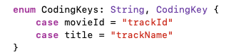

# Practica iOS Avanzado

En la práctica de iOS avanzado, nos aprovecharemos de la arquitectura flexible y robusta que hemos construido para añadir un montón de funcionalidad a nuestra app `Midia` con muy poco trabajo.

La parte obligatoria de la práctica consistirá en introducir películas en la app. Re-usando nuestra capa de red y los distintos motores de persistencia. Lo haremos sin tocar una sola línea de los `VieControllers`!!!

Vamos a consumir una API de iTunes. Aquí tienen la documentación:
[https://developer.apple.com/library/archive/documentation/AudioVideo/Conceptual/iTuneSearchAPI/SearchExamples.html#//apple_ref/doc/uid/TP40017632-CH6-SW1]()

Pero no nos agobiemos, paso a paso...

## Modelo/serialización

1. Crea un struct `Movie` con las propiedades que necesitas para rellenar las pantallas de nuestra app. **Recordatorio** las propiedades no tienen porque llamarse igual que las de la clase `Book`, por ejemplo, `publishedDate` tiene sentido que pase a ser `releaseDate`. Añade un constructor inicializando todas las propiedades, recuerda la conveniencia de los valores por defecto en las propiedades opcionales.
2. Haz que `Movie` conforme el protocolo `MediaItemProtocol`.
3. Haz una llamada GET con Postman a la url `https://itunes.apple.com/search/?media=movie&attribute=movieTerm&term=top&country=es`, guarda el resultado en un documento `json` y arrástralo a los tests del proyecto junto con el archivo `book-search-response.json`. Tiene una estructura diferente a las respuestas de la API de Google Books, no te asustes, `Codable` nos ayudará. Puedes cambiar los parámetros de búsqueda si quieres.


4. Crea un archivo de tests para las películas. Crea y escribe un test de existencia de tu película favorita (o una que te guste mucho si no puedes elegir solo una como me pasa a mí) quiero saberla =)
5. Crea un struct `MovieCollection` será parecido a `BookCollection`, pero esta vez utiliza el nombre de las propiedades del json de las películas (`resultCount` y `results`)
6. Ahora es donde se pone interesante. Crea un `testDecodeMovie` para hacer una serialización, vamos a pasar del `json` al objeto `MovieCollection`. Para ello tienes que hacer que tanto `MovieCollection` como `Movie` conformen el protocol `Decodable`. Utiliza la clase `Book` como referencia. **Recomendación**: decodifica de momento solo las propiedades no opcionales, para que pasen el test, las demás pueden valer `nil` mientras tanto. **Cuidado**, los `ids` de esta API son numéricos, hay que pasarlos a `String`



7. Decofifica el resto de propiedades.
8. Haz que `Movie` conforme el protocol `MediaItemDetailedProtocol`.

## Network

Es hora de hacer la capa de networking para este nuevo `MediaITem`. Va a ser extremadamente fácil, gracias a nuestra capa de abstracción.

1. Crea una implementación de nuestro protocolo `MediaItemAPIConsumable` para Alamofire y otra para NSURLSession, puedes llamarlas `ITunesMoviesAPIConsumerAlamofire` y `ITunesMoviesAPIConsumerNSURLSession` por ejemplo.
2. Añade en el fichero de constantes las un struct para las constantes de la API de iTunes, úsalas en ambas implementaciones. Recuerda añadir los `URLQueryItems` necesarios para construir la URL.

Para búsquedas:

```
media: movie
attribute: movieTerm
country: es
```

Para recuperar película por id:

```
id: {{trackId}}
country: es
```

3. Llega el momento de ver los resultados de nuestro trabajo!!! Cambia el `MediaItemKind` por defecto en el `AppDelegate` y maneja el `case` de `movie` en el constructor del `MediaItemProvider`. Y dale al play :)
4. Comprueba que ves películas en la home y que puedes hacer búsquedas. Los favoritos deberían ser libros todavía, pero no te preocupes, vamos a por ello en el siguiente apartado.

## Persistencia

Queremos también ser capaces de guardar películas como favoritos, así que manos a la obra.

1. Haz que `Movie` sea `Codable`, es decir `Encodable` + `Decodable`. Implementa el encoder, vamos a necesitarlo para guardar películas con `UserDefaults`.
2. Implementa un test `testDecodeEncodeMovie` donde primero vas a codificar una película y después decodificarla. Recuerda la recomendación de empezar solo haciendo las propiedades obligatorias. Asegúrate que cuando acabes puedes codificar/decodificar una película con todas sus propiedades.
3. Haz los cambios necesarios en el `UserDefaultsStorageManager` para guardar Movies.
4. Inicializa el `StorageManager` con `UserDefaults` y películas, comprueba que todo funciona bien :)
5. CoreData: Añade la entidad `Movie`. Recuerda llamar a clase la generada por CoreData `MovieManaged` para que no entre en conflicto con nuestro modelo actual.
6. Haz los cambios necesarios en el `CoreDataStorageManager` para soportar películas. Acuérdate de la extensión para pasar de `Movie` a `MovieManaged` y viceversa.
7. Inicializa el `StorageManager` con `CoreData` y películas, comprueba que todo funciona bien :)


## Extra, extra!!!


1. Todo esto es precioso, pero está feo decirle al usuario final que modifique el `AppDelegate` y el `StorageManager` para cambiar entre películas, libros, juegos o lo que sea.

Cómo se te ocurre solucionarlo?? Siéntete libre de imaginar soluciones diferentes.

**Sugerencia:** Qué te parece un cuarto tab en el `TabBarController`? Podría tener botones para cambiar el tipo de media item. Entonces también podrías crear una clase que herede de `TabBarController` y sea capaz de cambiar el `MediaItemKind` en el media provider, el `StorageManager` y actualizar sus `viewControllers`.

2. Un poco de Auto-layout. Vamos a crear un nuevo storyboard con una nueva vista de detalle. Siguiendo el siguiente diseño. A ver qué tal se te da el auto-layout sin ruedines!


